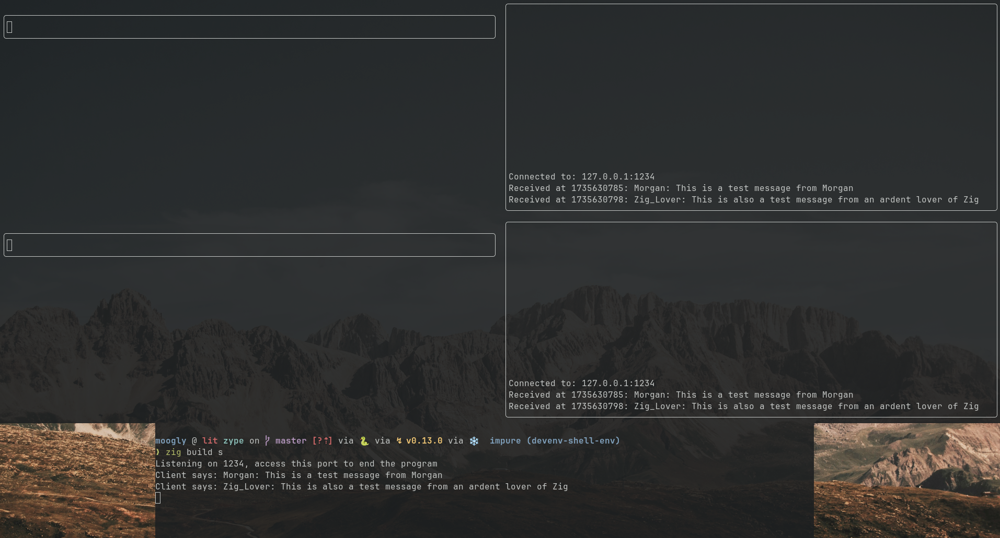

# Zype
Zype is a toy messaging terminal client and server that is written in Zig with a TUI using the libvaxis library.



### Reason for existing

This project started as a way to learn Zig and dip my toes into some manual memory management while working on a familiar problem. This is a very basic project and was not inteded for any sort of scalability or advanced features.

However I learnt a good deal about the basics of the Zig lanuage itself, a brief foray into multithreading and thread pools, and that this server can handle ~250k req/s with some garbage LLM generated stress test python code.

### Building Zype
Both the terminal and server run cross platform on Linux and Windows (I have not tested other systems), using the 0.14.1 version of the Zig compiler. Use `Control-P` to connect to the server.

The client can be built and run by:

```python
zig build c
```
The username is passed in by the first arg:
```
zig build c -- username_1
```
The server can be built and run by:
```
zig build s
```
Or both with binaries with:
```
zig build
```
